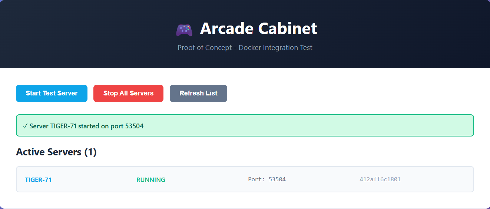

# Arcade Cabinet

# How to run

Before running, ensure Docker Desktop is installed and running.

This project is cross-platform (Windows/Mac/Linux) and the backend talks to Docker via the Docker socket mount (`/var/run/docker.sock`).

If you enable the optional Playit sidecar, set `SECRET_KEY` in `.env`.

If the backend returns `503 Service Unavailable` when you click “Start server”, it means it cannot reach Docker from inside the backend container:
- Windows (Docker Desktop): set `DOCKER_SOCK_PATH=//var/run/docker.sock` in `.env`, then `docker compose down` and `docker compose up --build`.
- Any OS (fallback): enable Docker’s TCP API and set `DOCKER_HOST=tcp://host.docker.internal:2375` in `.env` (less secure; dev/class projects only).

- On the command line run with
```
docker-compose up --build  
```

This will start the backend on port 8000 and frontend on port 3000.

# How to contribute
Follow this project board to know the latest status of the project: [https://nq-98.atlassian.net/jira/software/projects/AC/boards/35] 

### How to build
- Use this github repository: ... 
- Specify what branch to use for a more stable release or for cutting edge development.  
- Use InteliJ 11
- Specify additional library to download if needed 
- What file and target to compile and run. 
- What is expected to happen when the app start. 
